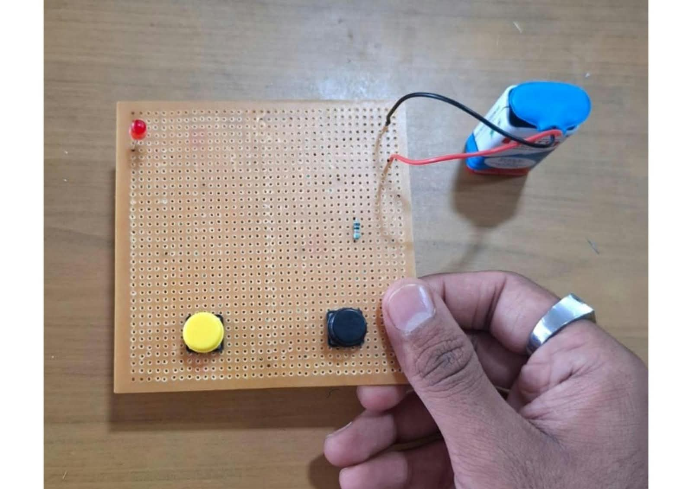

  
**AND Gate** 

Aim:  
       To construct and test an AND gate circuit by soldering the required electronic components.

Components Required:  
       •AND gate IC (7408)  
       •LEDs – 2  
       •Resistors – 2  
       •Connecting wires  
       •PCB / Veroboard  
       •Soldering iron  
       •Soldering wire  
       •5V DC power supply

Working:  
       The AND gate gives a HIGH output only when both inputs are HIGH. If any one input is LOW, the output will be LOW. The output is indicated using an LED.  
       
Procedure:  
     1\. Collect all the required components.   
     2\. Place the AND gate IC and other components on the PCB/veroboard.  
     3\. Connect the components according to the AND gate circuit diagram.  
     4\. Solder the connection carefully using a soldering iron.  
     5\. Connect the power supply to the circuit.  
     6\. Give different combinations of inputs and observe the output LED.  
     7\. Verify the output with the truth table.

Result:  
     The AND gate circuit was successfully assembled and soldered. The output obtained for different input combinations was verified with the AND gate truth table.

##Result :

